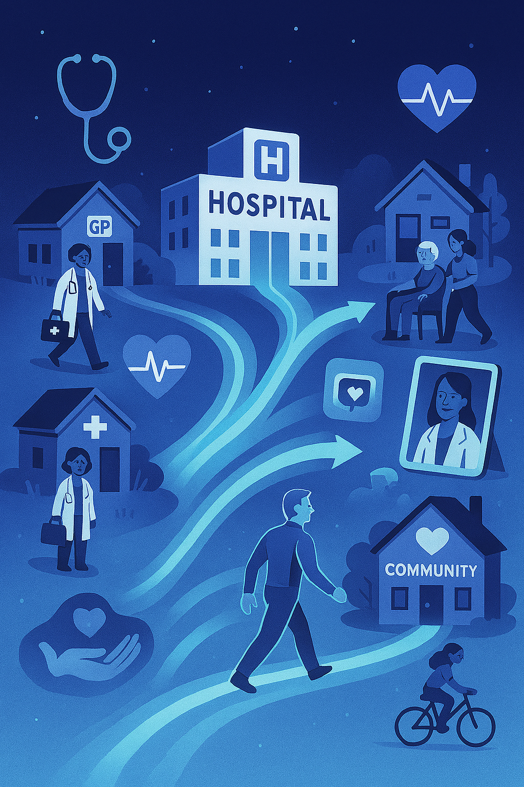
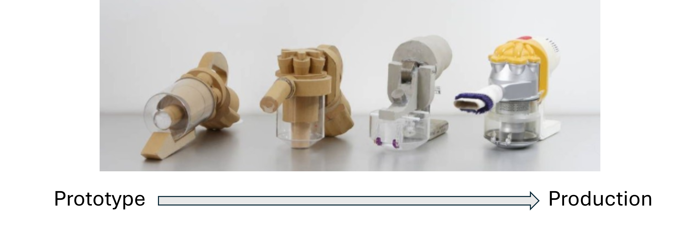

```{r setup}
#| echo: false

setwd("C:/Users/andrewhood/OneDrive - NHS/NHIP/left shift/git_repo/care_shift_tracker/")
library(targets)
library(quarto)
library(tidyverse)
library(gt)

```

## Introduction

- Me & team\
- The project in context:\
  - Supplier induced demand\
  - Neighbourhoods IC\
  - Complementary to e.g. TPMA explorer, Evidence reviews etc...\
- Objectives for today's session:\
  - Awareness\
  - User feedback

## TL;DR

- The concept is difficult to describe and measure\
- The data is often poor\
- Difficult to derive insights i.e. causal impacts\
- We've given it a good go\
- **System dynamics** and **simulation** likely a better analytical play\
- **Infrastructure** will be critical to facilitating any shifts in care [OPINION]

## Care shift concept

:::: {.columns}
::: {.column width="40%"}

:::

::: {.column width = "60%"}
Shifting care is a dynamic and complex process. Everyone would have a different idea of what it means to them, their services or communities.

The ideas and product journey was seeded through the New Hospitals Programme, steered by Community and Frailty programmes, made tangible by the 10-year plan, resourced and couched within NNHIP.

Trying to measure the shift:

- Generic versus condition/sub-population focus?\
- Whole system versus components?\
- Commissioner versus Locality versus Delivery?
:::
::::

## Indicators and themes

::::{.columns}

::: {.column width = "70%"}
```{r indicators}

readxl::read_excel("C:/Users/andrewhood/OneDrive - NHS/NHIP/left shift/indicators_short_list.xlsx")|>
  gt() |>
  opt_all_caps() |>
  opt_stylize(style = 6, color = 'gray')

```
:::

::: {.column width = "30%"}
<div style="font-size: 0.8em">
There were **many many many** indicators we explored for inclusion in the tracker. As well as trying to keep the number manageable, we excluded measures that had:\
<br>
- significant **overlap** with others;\
- that suffered from **poor data quality**;\
- that didn't have sufficient **time series**;\
- too **small numbers**;\
- that couldn't be wrangled into our 3 **unit levels**;\
- that didn't have **national coverage** and so on...
</div>
:::

::::

## The tracker tool

<style>
.highlight-box {
  position: absolute;
  top: 460px;      /* adjust to match your image */
  left: 160px;     /* adjust to match your image */
  width: 510px;    /* size of the highlight */
  height: 350px;
  border: 4px solid red;
  box-sizing: border-box;
}
</style>

- Experimental
- R Shiny interface\
- Data through multiple lenses\
- Multiple levels of interest\
- Up-to-date (Nov '25, 3-mth lag)

<br>

<div class="fragment">  </div>

<div class="fragment highlight-box"></div>

## Limitations & Caveats

- Partial coverage of the shift concept\
- Still a collection of silo'd views\
- Data quality and consistency away from acute sector\
- Some data gymnastics to align indicators at the 3 levels

## Walk-through

<iframe src="https://connect.strategyunitwm.nhs.uk/nhnip_care_shift_tracker_dev/"
        title="Care Tracker Tool"
        width="1600"
        height="800">
</iframe>

## The what next?

- Developing tool interface and visuals further?\
  - Is the content right?\
  - Are the visuals useful?\
  - Is there sufficient explanation?\
  - What else would add value?\
- Utilising more system-wide data (social care, primary care?)\
- Links to evidence of impact/improvement\
- Concepts applied to different pathways/population sub groups?\
- Feed into system dynamics model and simulations

## Thank you and questions


